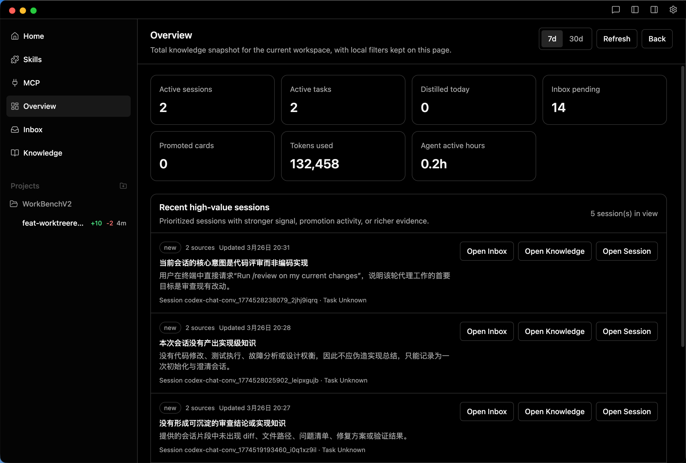
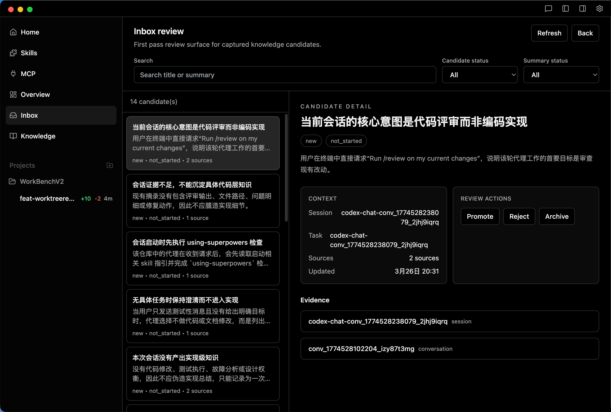
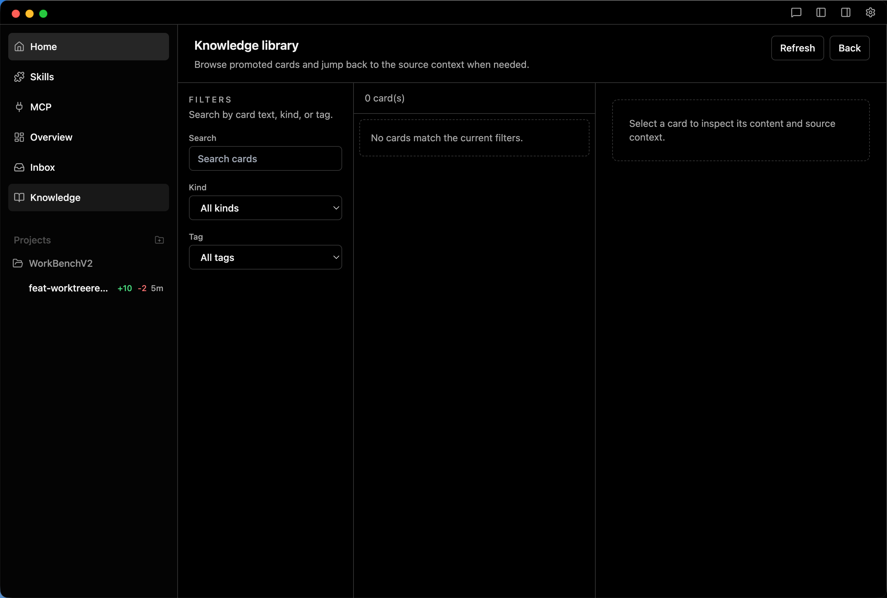

<div align="center">

English | [简体中文](./README.zh-CN.md)

</div>


<div align="center" style="margin:24px 0;">
  
<br />

[](./LICENSE.md)
[](https://github.com/EricOo0/Agent_workBench/releases)
[](https://github.com/EricOo0/Agent_workBench)
[](https://github.com/EricOo0/Agent_workBench/commits/main)
[](https://github.com/EricOo0/Agent_workBench/graphs/commit-activity)
<br>
[](https://discord.gg/f2fv7YxuR2)
<a href="https://www.ycombinator.com"></a>
[](https://twitter.com/intent/follow?screen_name=emdashsh)

<br />

  <a href="https://github.com/EricOo0/Agent_workBench/releases" style="display:inline-block; margin-right:8px; text-decoration:none; outline:none; border:none;">
    
  </a>
  <a href="https://github.com/EricOo0/Agent_workBench/releases" style="display:inline-block; margin-right:8px; text-decoration:none; outline:none; border:none;">
    
  </a>
  <a href="https://github.com/EricOo0/Agent_workBench/releases" style="display:inline-block; text-decoration:none; outline:none; border:none;">
    
  </a>

</div>

<br />

Agent WorkBench is a desktop Agentic Development Environment focused on turning coding sessions into reusable engineering knowledge. It keeps the upstream multi-agent, multi-worktree workflow from Emdash, and adds a knowledge workbench layer on top so useful results do not disappear when a terminal session ends.

This project is forked from [generalaction/emdash](https://github.com/generalaction/emdash). The fork keeps the original provider-agnostic ADE foundation and extends it with session summary distillation, knowledge candidate review, and knowledge reuse workflows tailored for long-running engineering work.

Agent WorkBench supports the same upstream multi-agent terminal workflow: you can run multiple coding agents in parallel, isolate them in git worktrees, connect to remote machines over SSH, pass tickets into agents, review diffs, test changes, create PRs, and inspect CI/CD status.

## Why This Fork

This fork is opinionated about one thing: coding-agent output should become durable team knowledge instead of transient terminal history.

### Highlights Added In This Fork

- **Session summary distillation**
  When a provider session exits, WorkBench can distill the session into a structured summary instead of leaving the outcome buried in terminal scrollback.
- **Inbox review for candidate knowledge**
  A single session can produce zero to multiple candidate knowledge cards. Low-value noise is filtered out, and higher-signal takeaways are reviewed in an Inbox before promotion.
- **Knowledge library**
  Promoted cards become a searchable library of reusable implementation patterns, debugging lessons, workflow guidance, and architectural decisions.
- **Overview for activity and knowledge output**
  Overview surfaces active sessions, active tasks, distillation output, promoted cards, and usage metrics to help track whether the workbench is producing useful knowledge.
- **Editable distillation prompt**
  The summary extraction prompt is configurable from the app, so teams can tune what “valuable knowledge” means for their own engineering context.

### Upstream Foundation Retained

This fork still builds on the upstream Emdash ADE foundation:

- provider-agnostic CLI agent support
- parallel agent workflows
- git worktree isolation
- diff review and PR flow
- SSH-based remote development

**Develop on remote servers via SSH**

Connect to remote machines via SSH/SFTP to work with remote codebases. Agent WorkBench supports SSH agent and key authentication, with secure credential storage in your OS keychain. Run agents on remote projects using the same parallel workflow as local development.

<div align="center" style="margin:24px 0;">

[Why This Fork](#why-this-fork) • [Installation](#installation) • [Contributing](#contributing) • [FAQ](#faq)

</div>

## Featured Workflow Surfaces

<div align="center">
  
</div>

<p><strong>Overview</strong> gives you a high-level entry point into active work so you can see status, jump to the right workspace, and keep parallel threads understandable.</p>

<div align="center">
  
  
</div>

<p><strong>Inbox</strong> helps you triage surfaced updates and pending items. <strong>Knowledge</strong> keeps promoted cards and source-linked context available for reuse, so important findings do not disappear into a single task thread.</p>

# Installation

### macOS
- Apple Silicon: https://github.com/EricOo0/Agent_workBench/releases/latest/download/agent-workbench-arm64.dmg
- Intel x64: https://github.com/EricOo0/Agent_workBench/releases/latest/download/agent-workbench-x64.dmg

[](https://formulae.brew.sh/cask/emdash)
> macOS users can also package locally from source using `pnpm run package:mac`

### Windows
- Installer (x64): https://github.com/EricOo0/Agent_workBench/releases/latest/download/agent-workbench-x64.msi
- Portable (x64): https://github.com/EricOo0/Agent_workBench/releases/latest/download/agent-workbench-x64.exe

### Linux
- AppImage (x64): https://github.com/EricOo0/Agent_workBench/releases/latest/download/agent-workbench-x86_64.AppImage
- Debian package (x64): https://github.com/EricOo0/Agent_workBench/releases/latest/download/agent-workbench-amd64.deb

### Release Overview

**[Latest Releases (macOS • Windows • Linux)](https://github.com/EricOo0/Agent_workBench/releases/latest)**

# Upstream Capabilities

This fork inherits the upstream provider matrix, integrations, and ADE workflow from Emdash.
If you want the full provider list, installation matrix, and original product overview, see:

- upstream repo: [generalaction/emdash](https://github.com/generalaction/emdash)
- upstream docs: [docs.emdash.sh](https://docs.emdash.sh)

# Contributing

Contributions welcome! See the [Contributing Guide](CONTRIBUTING.md) to get started, and join our [Discord](https://discord.gg/f2fv7YxuR2) to discuss.

# FAQ

<details>
<summary><b>What telemetry do you collect and can I disable it?</b></summary>

> We send **anonymous, allow‑listed events** (app start/close, feature usage names, app/platform versions) to PostHog.  
> We **do not** send code, file paths, repo names, prompts, or PII.
>
> **Disable telemetry:**
>
> - In the app: **Settings → General → Privacy & Telemetry** (toggle off)
> - Or via env var before launch:
>
> ```bash
> TELEMETRY_ENABLED=false
> ```
>
> Full details: see `docs/telemetry.md`.
</details>

<details>
<summary><b>Where is my data stored?</b></summary>

> **App data is local‑first**. We store app state in a local **SQLite** database:
>
> ```
> macOS:   ~/Library/Application Support/emdash/emdash.db
> Windows: %APPDATA%\emdash\emdash.db
> Linux:   ~/.config/emdash/emdash.db
> ```
>
> **Privacy Note:** While Agent WorkBench itself stores data locally, **when you use any coding agent (Claude Code, Codex, Qwen, etc.), your code and prompts are sent to that provider's cloud API servers** for processing. Each provider has their own data handling and retention policies.
>
> You can reset the local DB by deleting it (quit the app first). The file is recreated on next launch.
</details>

<details>
<summary><b>Do I need GitHub CLI?</b></summary>

> **Only if you want GitHub features** (open PRs from Agent WorkBench, fetch repo info, GitHub Issues integration).  
> Install & sign in:
>
> ```bash
> gh auth login
> ```
>
> If you don’t use GitHub features, you can skip installing `gh`.
</details>

<details>
<summary><b>How do I add a new provider?</b></summary>

> Agent WorkBench is **provider‑agnostic** and built to add CLIs quickly.
>
> - Open a PR following the **Contributing Guide** (`CONTRIBUTING.md`).
> - Include: provider name, how it’s invoked (CLI command), auth notes, and minimal setup steps.
> - We’ll add it to the **Integrations** matrix and wire up provider selection in the UI.
>
> If you’re unsure where to start, open an issue with the CLI’s link and typical commands.
</details>

<details>
<summary><b>I hit a native‑module crash (sqlite3 / node‑pty / keytar). What’s the fast fix?</b></summary>

> This usually happens after switching Node/Electron versions.
>
> 1) Rebuild native modules:
>
> ```bash
> npm run rebuild
> ```
>
> 2) If that fails, clean and reinstall:
>
> ```bash
> npm run reset
> ```
>
> (Resets `node_modules`, reinstalls, and re‑builds Electron native deps.)
</details>

<details>
<summary><b>What permissions does Agent WorkBench need?</b></summary>

> - **Filesystem/Git:** to read/write your repo and create **Git worktrees** for isolation.  
> - **Network:** only for provider CLIs you choose to use (e.g., Codex, Claude) and optional GitHub actions.  
> - **Local DB:** to store your app state in SQLite on your machine.
>
> Agent WorkBench itself does **not** send your code or chats to any servers. Third‑party CLIs may transmit data per their policies.
</details>


<details>
<summary><b>Can I work with remote projects over SSH?</b></summary>

> **Yes!** Agent WorkBench supports remote development via SSH.
>
> **Setup:**
> 1. Go to **Settings → SSH Connections** and add your server details
> 2. Choose authentication: SSH agent (recommended), private key, or password
> 3. Add a remote project and specify the path on the server
>
> **Requirements:**
> - SSH access to the remote server
> - Git installed on the remote server
> - For agent auth: SSH agent running with your key loaded (`ssh-add -l`)
>
> See [docs/ssh-setup.md](./docs/ssh-setup.md) for detailed setup instructions and [docs/ssh-architecture.md](./docs/ssh-architecture.md) for technical details.
</details>

[](https://x.com/emdashsh)
[](https://x.com/rabanspiegel)
[](https://x.com/arnestrickmann)
